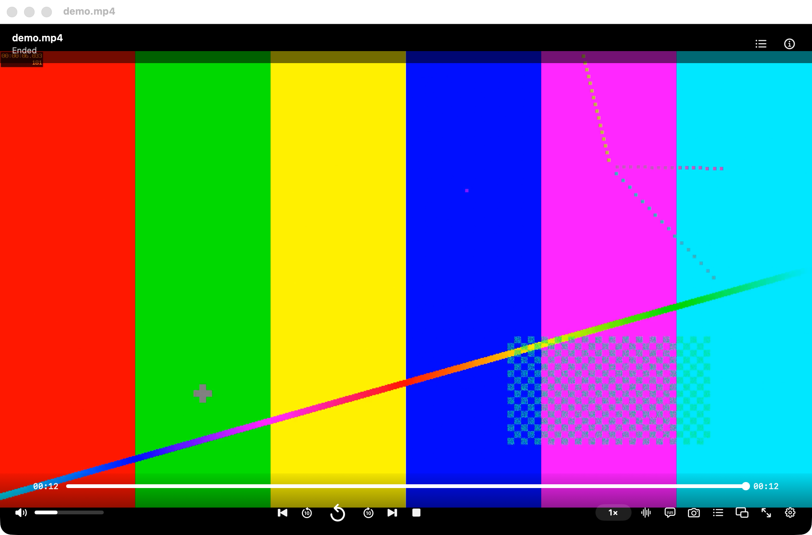

<h1 align="center">MacMedia</h1>

<p align="center">Native macOS media player with a bundled libmpv engine.</p>

<p align="center">
  <a href="https://github.com/MoomenALdahdouh/MacMedia/actions/workflows/ci.yml"></a>
  <a href="LICENSE"></a>
  <a href="https://github.com/MoomenALdahdouh/MacMedia/releases/latest"></a>
  
  
</p>

---

## Overview

MacMedia is a native AppKit player for Apple Silicon. The UI stays small; playback is delegated to vendored [libmpv](https://mpv.io) (FFmpeg, VideoToolbox, libass). No accounts, ads, telemetry, or network requirement at runtime.

<p align="center">
  
</p>

## Installation

### Binary (recommended)

Download **MacMedia.dmg** from the [latest release](https://github.com/MoomenALdahdouh/MacMedia/releases/latest), then:

```bash
# Drag MacMedia.app into /Applications, then clear Gatekeeper quarantine
xattr -dr com.apple.quarantine /Applications/MacMedia.app
open /Applications/MacMedia.app
```

First launch: **right-click → Open** if macOS still blocks the app. The build is signed for development and is not Apple-notarized.

Requires macOS 13+ on Apple Silicon (arm64 only).

### From source

```bash
git clone https://github.com/MoomenALdahdouh/MacMedia.git
cd MacMedia

brew install meson ninja pkgconf ffmpeg libass libplacebo little-cms2 uchardet zimg libarchive jpeg-turbo

Scripts/vendor-libs.sh
swift build -c release --product MacMedia
Scripts/package-app.sh
Scripts/install.sh
```

Homebrew is a **build-time** dependency only. The packaged `.app` vendors libmpv and FFmpeg dylibs under `@rpath`.

## Usage

Open a file with ⌘O, drag-and-drop, or `open -a MacMedia ./clip.mp4`.

| Key | Action |
| --- | --- |
| Space | Play / pause / replay |
| ← → | Seek |
| ⇧← ⇧→ | Larger seek |
| ↑ ↓ | Volume |
| M | Mute |
| F | Fullscreen |
| S | Screenshot (`~/Pictures/MacMedia`) |
| ⌘N | New window |

Chrome (title bar, file info, controls) auto-hides together while a file is playing; hover to show it again. Defaults are editable in **Settings → Keyboard**.

## Development

```bash
Scripts/vendor-libs.sh          # clone mpv 0.41.0 and build libmpv
swift build -c debug --product MacMedia
Scripts/gen-test-media.sh
Scripts/run-tests.sh
Scripts/package-app.sh          # build/MacMedia.app
Scripts/package-dmg.sh          # build/MacMedia.dmg
```

Layout:

```text
Sources/MacMedia          AppKit / SwiftUI UI
Sources/MacMediaCore      coordinator, playlist, preferences, MpvEngine
Sources/CMpv              libmpv C module
Vendor/                   generated libmpv (not committed)
```

See [BUILD.md](BUILD.md), [CONTRIBUTING.md](CONTRIBUTING.md), and [Documentation/ARCHITECTURE.md](Documentation/ARCHITECTURE.md).

## License

GPL-3.0-or-later ([LICENSE](LICENSE)). Bundled libmpv / FFmpeg / libass keep their own terms; see [THIRD_PARTY_LICENSES.md](THIRD_PARTY_LICENSES.md) and [NOTICE.md](NOTICE.md).

## Support

[Buy me a coffee](https://ko-fi.com/moomenaldahdouh)
